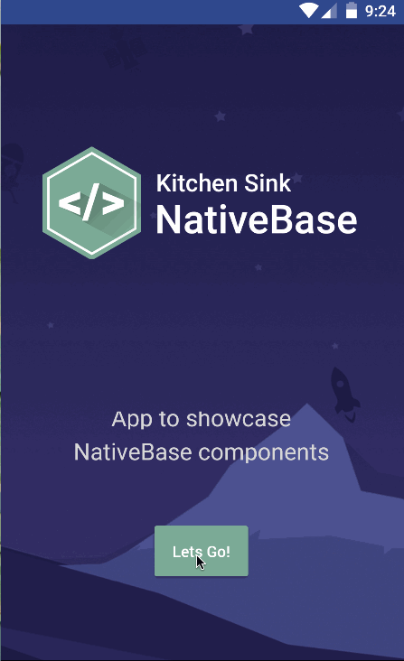

# NativeBase KitchenSink v2.2.1
An example app with all the UI components of NativeBase

> **NativeBase-KitchenSink** comes in three forms of app for you!
>1. Pure React Native App with `react-navigation` on branch **[master](https://github.com/GeekyAnts/NativeBase-KitchenSink)**
>2. Pure React Native App with `RNRF` on branch **[RNRF](https://github.com/GeekyAnts/NativeBase-KitchenSink/tree/RNRF)**
>3. An Expo app with `CRNA` and `react-navigation` on branch **[CRNA](https://github.com/GeekyAnts/NativeBase-KitchenSink/tree/CRNA)**

>Find the installation guide in `ReadMe` of appropriate branches

## Demo

iOS | Android
 :--:| :-----:
  | 


[NativeBase](http://nativebase.io/) is a free and open source framework that enables developers to build high-quality apps using [React Native](https://facebook.github.io/react-native/) for iOS and Android with a fusion of ES6. NativeBase builds a layer on top of React Native that provides you with basic set of components for mobile application development. This helps you to build world-class application experiences on native platforms.

NativeBase without a doubt fits in well with mobile applications which cut downs one huge part of your app - The Front end.
The applications stack of components is built using native UI components, so there are no compromises with the user experience.


## Get Started


#### 1. Installation

On the command prompt run the following commands

```sh
$ git clone git@github.com:GeekyAnts/NativeBase-KitchenSink.git

$ cd NativeBase-KitchenSink/

$ npm install

$ react-native link
```

#### 2. Simulate for iOS

**Method One**

*	Open the project in Xcode from **ios/NativebaseKitchenSink.xcodeproj**.

*	Hit the play button.


**Method Two**

*	Run the following command in your terminal.

```sh
$ react-native run-ios
```

#### 3. Simulate for Android

*	Make sure you have an **Android emulator** installed and running.

*	Run the following command in your terminal.

```sh
$ react-native run-android
```
#### 4. Exponent

* Get a quick look of the NativeBase components using <a href="https://getexponent.com/">Exponent</a>

*  Link https://exp.host/@geekyants/nativebasekitchensink

## Quick Links to NativeBase

*	[NativeBase Website](http://nativebase.io)
*	[NativeBase Documentation](http://nativebase.io/documentation)
*	[NativeBase on Twitter](https://twitter.com/NativeBaseIO)
*	[NativeBase Blog](https://medium.com/nativebase-io-blog)


For apps with more advanced designs using NativeBase, please visit **[NativeBase Market](https://market.nativebase.io)**.
